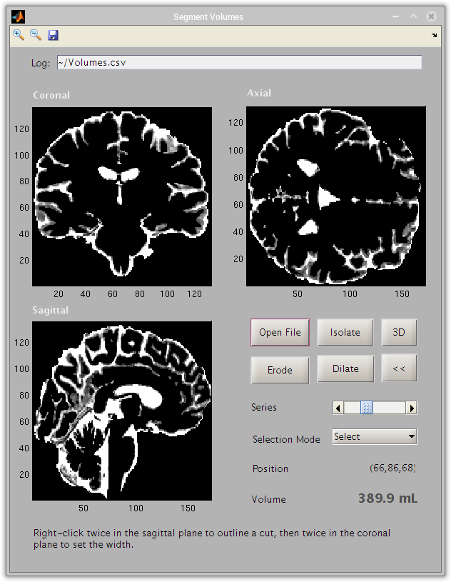
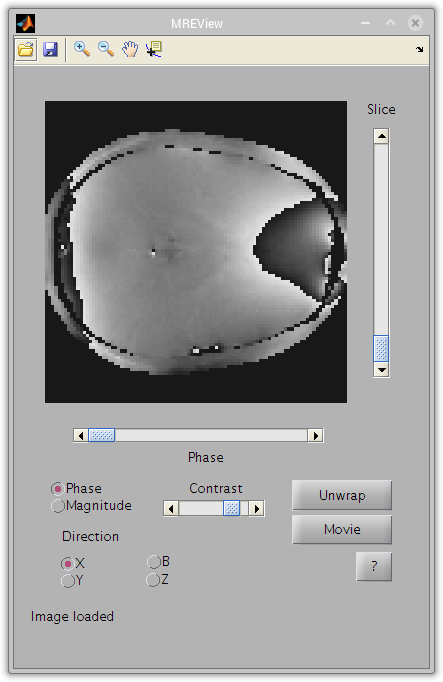

# MR Elastography Matlab Toolbox

A Matlab toolbox for working with magnetic resonance elastography (MRE) images. 

## Features

- Open common image formats such as DICOM and NIFTI and load into Matlab arrays with correct orientation and dimensionality
- Viewer for 3D to 5D images, with anti-aliasing (phase unwrap) tools
- Volume segmentation GUI with image processing features to extract information about subvolumes of NIFTI files (e.g., determine the volume of the ventricles in the brain)
- MRE sequence simulator

## Screenshots



_**Figure:** Volume Segmentation_



_**Figure:** MREView_

## Installation

### Using Git

Make a personal copy of the repository by running `git clone /path/to/repository` in the place where you want the files to appear. This will copy the repository to a new folder on your computer. On GitHub, there is a link you can copy with the path in a box on the right side of the page. Using Git ensures that you can easily get updates by running `git pull`, as well as track your own changes and create pull requests.

### Download ZIP Archive

GitHub allows you to download a snapshot of the code as it stands. You'll have to download the ZIP again to get updates. Extract the files into a convenient folder.

### Add to path

In either case, remember to add the folder and subfolder to your Matlab path using the 'Preferences' menu or `path` command.

## Examples

[Examples.html](examples/html/examples.html) can be accessed in the Matlab documentation browser if you have added the toolbox to your path. Hit `F1` or type `doc` at the command line to access the browser. You can also open the file in your normal web browser.

## Help

Almost all of the Matlab files are covered by documentation in the source files. This can be accessed using Matlab's internal help browser by calling `doc functionname`. Contact the author of the file if you have further questions.

## Bugs

If you find a bug in one of the programs, please report it using GitHub Issues or email the author of the file in question.

## Dependencies

Individual features may not depend on all of the components listed below

- [NIFTI Toolbox for Matlab][niftitoolbox]: Free software (BSD License)
- [Image Processing Toolbox for Matlab][imageprocessing]: License required from the Mathworks
- [2D Phase Unwrapping Functions][phaseunwrap]: Free software (BSD License)
- [DCMDUMP][dcmdump]: Free software (BSD License)
- [FSL][fsl]: Free software from the University of Cambridge (Non-commercial license)
- [Fiji][fiji]: Free image processing suite (GNU GPL license) 
- [Miji][miji]: ImageJ interface in Matlab (BSD license)
- [Phase Tools][phasetools]: Phase unwrapping ImageJ plugin (CC-BY)

[niftitoolbox]:http://www.mathworks.com/matlabcentral/fileexchange/8797-tools-for-nifti-and-analyze-image/content/NIfTI_20140122.zip
[imageprocessing]:http://www.mathworks.com/products/image/
[phaseunwrap]:http://www.mathworks.com/matlabcentral/fileexchange/29497-goldsteinunwrap2d-r1
[dcmdump]:http://support.dcmtk.org/docs/dcmdump.html
[fsl]:http://fsl.fmrib.ox.ac.uk/fsl/fslwiki/
[fiji]:http://fiji.sc
[miji]:http://fiji.sc/Miji
[phasetools]:http://cognitive-eurhythmics.com/code.html

## License

The MRE Matlab Toolbox is free software licensed under the open-source Apache License 2.0. 
Unless otherwise noted, the following copyright notice applies to all files in the MRE Matlab Toolbox.

```
Copyright 2014 Albert Einstein College of Medicine and Contributors

Licensed under the Apache License, Version 2.0 (the "License");
you may not use this file except in compliance with the License.
You may obtain a copy of the License at

    http://www.apache.org/licenses/LICENSE-2.0

Unless required by applicable law or agreed to in writing, software
distributed under the License is distributed on an "AS IS" BASIS,
WITHOUT WARRANTIES OR CONDITIONS OF ANY KIND, either express or implied.
See the License for the specific language governing permissions and
limitations under the License.
```

- [Attribution Notice](NOTICE.txt)
- [Apache License 2.0](LICENSE.txt)
